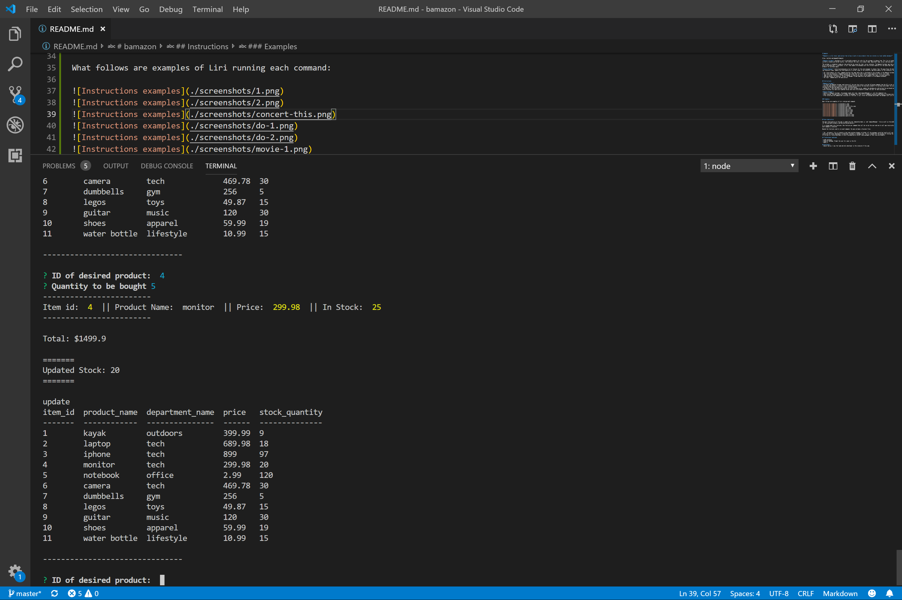

# bamazon

**Bamazon is a CLI retail application that allows clients to buy products that are stored in a local mySQL database**

https://github.com/dagamo94/bamazon

**Bamazon Customer** displays a list of available products for sale for the customer to choose from. This list of products is pulled from a mySQL database, currently created and hosted locally, that contains the item's id, product name, department name, price, and available quantity. 

THe customer is prompted to make an item selection by using the item's id as reference. The Bamazon Customer app then asks the customer how many items they wish to purchase and, if available, it will then update the database with the leftover quantity for the specified item and display the list available products for purchase again.

**Bamazon Manager** starts by displaying a list of choices for the store manager to choose from. The app allows the manager to view products for sale, view low inventory items, update the stock quantity of current items in the inventory, add new products to the inventory, and finally quit the app if so desired.

* The 'View products for sale' command displays the same table that is displayed to the customer in the Bamazon Customer app.
* The 'View Low Inventory' command displays any items that currently have a stock quantity of ten or less items.
* 'Add to current Inventory' allows the manager to specify an item's id and update that item's in-stock quantity.
* 'Add new product to Inventory' allows the manager to add completely new products to the Bamazon database.
* The 'Quit' command quits the application.

## Instructions

**Bamazon Customer**
* To launch the Bamazon Customer application all the user has to do is run the following command from the CLI in the root folder 'node bamazonCustomer'.
* Once the application is running, it will automatically display the available products for purchase and prompt the user to type the ID of the desired item, followed by the desired quantity of items to be purchased.
* The app will then calculate and display the total purchase price, update the database by subtracting the purchased quantity from the stock quantity, and finally display the table with updated values and rerun the program to prompt the user for more purchases.

**Bamazon Manager**
* Similar to Bamazon Customer, the manager needs only type 'node bamazonManager.js' into the commancd line.
* Once running, the application will prompt the manager with the list of commands previously mentioned in the description.
* After selecting the command and finishing its function, it will rerun the program and prompt the manager with list of commands.

### Customer App Examples

What follows are examples of Bamazon Customer running each command:

### Manager App Examples

What follows are examples of Bamazon Manager running each command:

## App organization

The main functionality of the app is coded into the 'bamazonCustomer.js' and 'bamazonManager' files as well as the mySQL database creaed to store the values for the available products and any pertaining details.

It is broken down into functions. One function per command that will be run by the user and one to call app recursively so that it will keep running after each command is executed.

Beyond the functions used to run each command, the app includes a few more files:

* The '.gitignore' file is created so that when pushing changes to GitHub, all the packages installed locally will not be uploaded and create a larger repository for other developers to download. Instead, a 'package.json' file is created with the purpose of storing the list of required packages for Bamazon to run and for future developers to use to automatically install said packages in their own environments.

## Technologies employed

* mySQL database
* Inquirer package: Prompt the user for input in the CLI
* Node.js

## Developers:
- Daniel Garcia: I was the lead and only developer in the creation of this app.
